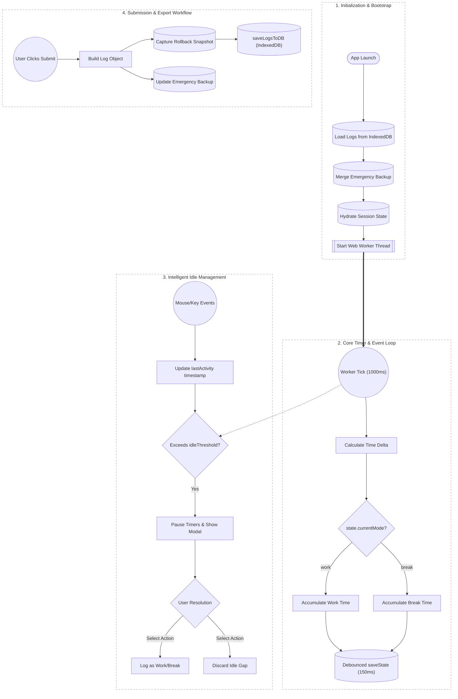

  
  
<strong>Zero backend. Zero latency. Total privacy. One file.</strong>

  <a href="#-features">Features</a> • 
  <a href="#-getting-started">Getting Started</a> • 
  <a href="#-command-palette-hud">Command Palette</a> • 
  <a href="#-architecture">Architecture</a>

---

## 📖 Overview

Most time trackers are bloated SaaS tools that harvest data, or barebones stopwatches that break when you close the tab. **nodrift** is an enterprise-grade, single-file web application that runs entirely in your browser.

It tracks active work hours, rest breaks, daily goals, and weekly workloads with analytical precision. Everything is stored locally on your machine via a failsafe IndexedDB + LocalStorage matrix. **No accounts. No servers. No subscriptions. No external dependencies.**

---

## ✨ Key Features

### ⏳ Intelligent Tracking & Smart Pacing
- **Adaptive Daily Goals:** The app dynamically calculates your required daily velocity to hit a 40-hour workweek, automatically deducting scheduled leaves and holidays.
- **Sleep & Idle Detection:** Steps away? The app detects system sleep and user inactivity, pausing your timer and prompting you to recover or discard the time when you return.
- **Midnight Rollover:** If you work past midnight, nodrift safely slices the shift, saves yesterday's logs, and starts a fresh day.

### 🧠 The Command Center (HUD)
Press `/` to open a Raycast-inspired, keyboard-first command palette.
- **Natural Language Logging:** Type `add yesterday 9am to 5pm worked on UI` to instantly generate and backdate a shift.
- **NLP Leave Engine:** Type `leave sick tomorrow` to instantly book time off.
- **Deep Search:** Type `log bugfix >4h` to instantly pull up past shifts matching your criteria.
- **Built-in Calculator:** Type math directly (`150 / 60`) and copy the result to your clipboard.

### 📊 Deep Analytics & Logbook
- **GitHub-Style Heatmap:** Visualize your tracking consistency, streaks, and focus ratios over the entire year.
- **Virtualized Logbook:** A custom-built 60fps virtual DOM that can render thousands of historical logs without lagging the browser.
- **Advanced Saved Views:** Filter logs by dates, hours worked, or specific notes, and save them as custom views for one-click access.

### 🛡️ Bulletproof Data Integrity
- **Snapshot Rollbacks:** Like Apple's Time Machine. Before any major DB write, nodrift takes a snapshot. Made a mistake? Revert your entire database to a previous state instantly.
- **Multi-Tab Sync Lockout:** `BroadcastChannel` + localStorage leasing ensures only one master tab writes to the DB to prevent data corruption.
- **Import Conflict Wizard:** When importing a backup, an interactive wizard helps you resolve colliding dates (Keep Local, Overwrite, or Keep Both).
- **RAM-Only Fallback:** Gracefully degrades to temporary memory if your browser storage quota is exceeded or blocked.

### 🎨 Design Systems
Instantly switch between four meticulously crafted design tokens:
**SF Light** (Apple Native) • **SF Dark** • **Vercel Dark** (High Contrast) • **E-Ink** (Brutalist Monochrome)

---

## 🚀 Getting Started

No build steps. No `npm install`.

1. **Download** or clone this repository.
2. **Open `index.html`** in any modern web browser (Chrome, Firefox, Safari, Edge).
3. Press `Spacebar` to start tracking.

> **Self-Hosting**: You can deploy the folder directly to Vercel, Netlify, or GitHub Pages. Note that browser storage is origin-bound; use the built-in **Export/Import JSON** feature when migrating devices or domains.

---

## ⌨️ Keyboard Shortcuts

Designed for power users, you can drive the entire app without a mouse.

| Shortcut | Action |
| :--- | :--- |
| <kbd>Spacebar</kbd> | Toggle Work / Break timers |
| <kbd>S</kbd> | Submit End of Day (EOD) shift |
| <kbd>/</kbd> | Open Command Palette (HUD) |
| <kbd>Ctrl/Cmd</kbd> + <kbd>S</kbd> | Download JSON Backup & Draft Email Summary |
| <kbd>Alt</kbd> + <kbd>N</kbd> | Open Manual Log Entry Modal |
| <kbd>Alt</kbd> + <kbd>T</kbd> | Cycle UI Themes |
| <kbd>Alt</kbd> + <kbd>1</kbd> / <kbd>2</kbd> | Switch between Insights / Logbook tabs |
| <kbd>E</kbd> / <kbd>D</kbd> / <kbd>C</kbd> | Edit, Delete, or Copy the currently highlighted log |

---

## 🏗️ Architecture & Workflow

nodrift operates on a sophisticated client-side architecture featuring background Web Worker threads to prevent timer throttling, debounced state persistence, and emergency fallback systems.

---

## 🛠️ Data Portability
Your data is yours. Period.
- **JSON Import/Export**: Fully portable state and logbook backups.
- **CSV Export**: Instantly download your logbook formatted for HR or Excel.
- **Auto-Timesheets**: The app can compile a daily summary, copy it to your clipboard, and automatically open a Gmail draft ready to send.

---

## 📄 License

This project is open-source and licensed under the [MIT License](LICENSE).
