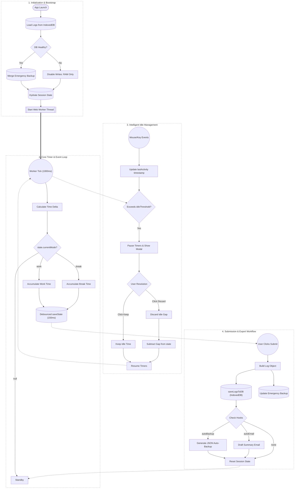

  
  <h1>NoDrift</h1>
  
<strong>Zero backend. Zero latency. Total privacy. One file.</strong>

  

    
    
    
    
  

---

## 📖 Overview

Most time trackers are bloated SaaS tools that harvest data or barebones stopwatches that break when you close the tab. **NoDrift** is an enterprise-grade, single-file web application that runs entirely in your browser. 

It tracks active work hours, rest breaks, daily goals, and weekly workloads with analytical precision. Everything is stored locally on your machine via a failsafe IndexedDB + LocalStorage matrix. **No accounts. No servers. No subscriptions.**

---

## ✨ Features

- **Standalone Monolith**: 100% self-contained in a single `index.html` file. Zero external dependencies.
- **Drift-Resistant Timers**: Dual-clock system (`Date.now()` + `performance.now()`) with Web Worker background processing.
- **Intelligent Idle Management**: Monitors inactivity to automatically pause timers and prompt for time recovery.
- **Virtual Logbook**: Custom DOM virtualization capable of rendering thousands of records at 60fps.
- **Command Palette (HUD)**: Raycast-inspired keyboard-first interface for tracking, searching, and configuring.
- **Data Portability**: Seamless CSV export, JSON backup/restore, and auto-email drafting.

---

## 🏗️ Architecture & Workflow

NoDrift operates on a sophisticated client-side architecture featuring background threads, debounced state persistence, and emergency fallback systems.

---

## 🚀 Getting Started

No build steps. No `npm install`.

1. **Download** or clone this repository.
2. **Open `index.html`** in any modern web browser (Chrome, Firefox, Safari, Edge).
3. Press `Spacebar` to start tracking.

> **Self-Hosting**: Deploy the folder directly to Vercel, Netlify, or GitHub Pages. Note that browser storage is origin-bound; use the **Export/Import JSON** feature when migrating domains.

---

## 🛠️ Core Capabilities

### Command Palette (HUD)
Press `/` to open the full-featured, fuzzy-search command center. Type natural language to control the app:
- `start work` / `stop break`
- `goal 8h 30m`
- `theme onyx`
- `export week`
- **NLP Writing**: `add yesterday 9am to 5pm worked on dashboard redesign`

### Failsafe Safety & Integrity
- **Multi-Tab Sync Lockout**: `BroadcastChannel` + localStorage leasing ensures only one master tab writes to the DB.
- **Emergency Recovery**: Submits are synchronously backed up to `localStorage` to catch logs missed by IndexedDB during dirty browser exits.
- **RAM-Only Fallback**: Gracefully degrades to a RAM-only mode if the user's storage quota is exceeded.

### Virtual Logbook & Heatmaps
The built-in analytics engine includes:
- **O(1) Virtualized Logbook**: Search, filter, and edit thousands of logs instantly.
- **GitHub-Style Heatmap**: Visualizes your daily effort intensity.
- **40-Hour Pacing**: Dynamically calculates your required daily velocity to hit your weekly target.

---

## ⌨️ Keyboard Shortcuts

| Shortcut | Action |
| :--- | :--- |
| <kbd>Spacebar</kbd> | Toggle Work / Break timers |
| <kbd>S</kbd> | Submit current shift |
| <kbd>/</kbd> | Open Command Palette |
| <kbd>Ctrl</kbd> + <kbd>S</kbd> | Auto-Backup & Draft Summary |
| <kbd>Alt</kbd> + <kbd>T</kbd> | Cycle Themes (SF Dark, Onyx, Cobalt, SF Light) |
| <kbd>Alt</kbd> + <kbd>1</kbd> / <kbd>2</kbd> | Switch between Insights / Logbook |
| <kbd>E</kbd> / <kbd>D</kbd> / <kbd>C</kbd> | Edit, Delete, Copy selected log |

---

## 💻 Development & Build System

While shipped as a monolith, the source code is built modularly.
- **`utils.js`**: Pure functions (`formatDuration`, `fuzzyScore`, etc.) separated for testability.
- **`index.test.html`**: Test harness.
- **`sync.bat` / `sync_utils.ps1`**: Automated build scripts that inline `utils.js` back into `index.html`.

---

## 📄 License

This project is open-source and licensed under the [MIT License](LICENSE).
