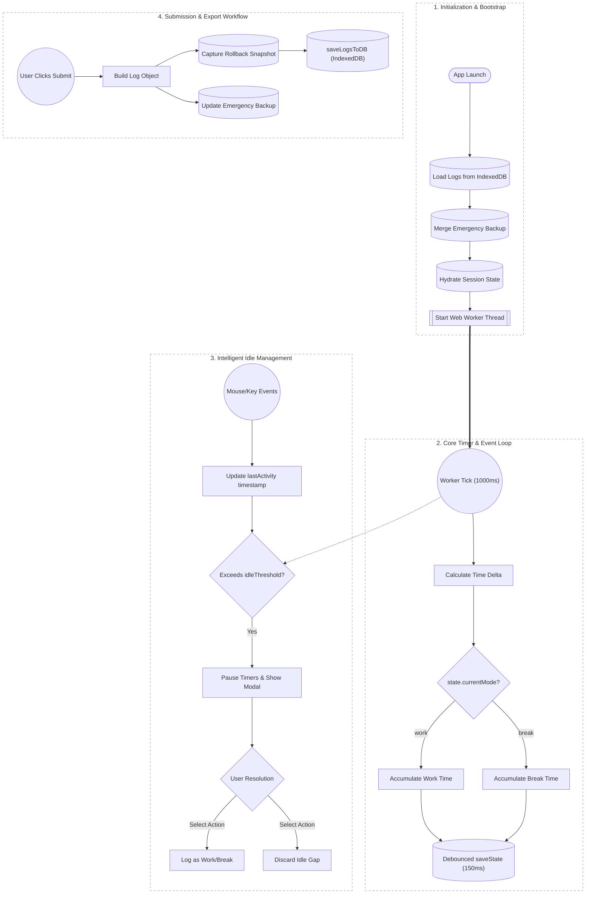

  
  
<strong>Local-first. Zero latency. Works signed out, forever.</strong>

  <a href="#-key-features">Features</a> • 
  <a href="#-getting-started">Getting Started</a> • 
  <a href="#-cloud-sync-optional">Cloud Sync</a> • 
  <a href="#-keyboard-shortcuts">Shortcuts</a> • 
  <a href="#-architecture--workflow">Architecture</a>

---

## 📖 Overview

Most time trackers are bloated SaaS tools that harvest data, or barebones stopwatches that break when you close the tab. **nodrift** is an enterprise-grade web application whose entire UI, logic and styling live in one `index.html`, and which runs in your browser rather than on someone's server.

It tracks active work hours, rest breaks, daily goals, and weekly workloads with analytical precision. Everything is stored on your machine via a failsafe IndexedDB + LocalStorage matrix, and every feature works with no account and no network. **No subscriptions. No telemetry. Nothing is uploaded unless you sign in and ask for it.**

> **Being precise about "local-first"**, because it is the whole point: the app is local-first, not offline-only. Signing in is optional and off by default, and turning it on sends your logbook to a Supabase project so it can reach your other devices — see [Cloud Sync](#-cloud-sync-optional). Signed out, nothing leaves the machine. The page also loads its two typefaces from Google Fonts; it renders correctly without them.

---

## ✨ Key Features

### ⏳ Intelligent Tracking & Smart Pacing

- **Adaptive Daily Goals:** The app dynamically calculates your required daily velocity to hit your weekly target — 40 hours by default, configurable — automatically deducting scheduled leaves and holidays.
- **Sleep & Idle Detection:** Steps away? The app detects system sleep and user inactivity, pausing your timer and prompting you to recover or discard the time when you return.
- **Midnight Rollover:** If you work past midnight, nodrift safely slices the shift, saves yesterday's logs, and starts a fresh day.

### 🧠 The Command Center (HUD)

Press `/` to open a Raycast-inspired, keyboard-first command palette.

- **Natural Language Logging:** Type `add yesterday 9am to 5pm worked on UI` to instantly generate and backdate a shift.
- **NLP Leave Engine:** Type `leave sick tomorrow` to instantly book time off.
- **Deep Search:** Type `log bugfix >4h` to instantly pull up past shifts matching your criteria.
- **Built-in Calculator:** Type math directly (`150 / 60`) and copy the result to your clipboard.

### 📊 Deep Analytics & Logbook

- **GitHub-Style Heatmap:** Visualize your tracking consistency, streaks, and focus ratios over the entire year.
- **Virtualized Logbook:** A custom-built 60fps virtual DOM that can render thousands of historical logs without lagging the browser.
- **Advanced Saved Views:** Filter logs by dates, hours worked, or specific notes, and save them as custom views for one-click access.

### 🛡️ Bulletproof Data Integrity

- **Snapshot Rollbacks:** Like Apple's Time Machine. Before any major DB write, nodrift takes a snapshot. Made a mistake? Revert your entire database to a previous state instantly.
- **Multi-Tab Sync Lockout:** `BroadcastChannel` + localStorage leasing ensures only one master tab writes to the DB to prevent data corruption.
- **Import Conflict Wizard:** When importing a backup, an interactive wizard helps you resolve colliding dates (Keep Local, Overwrite, or Keep Both).
- **RAM-Only Fallback:** Gracefully degrades to temporary memory if your browser storage quota is exceeded or blocked.

### ☁️ Cloud Sync (Optional)

Off by default. The app is fully functional, forever, without ever creating an account.

- **Opt-in, and reversible:** Sign in from the cloud icon in the footer. Signed out, no data leaves the machine.
- **Cross-device handoff:** A running shift, the logbook, tasks, leaves, saved views and settings all follow you. Only one device owns the live session at a time, enforced by a lease in Postgres rather than by hoping.
- **Last-writer-wins, guarded server-side:** The merge rule is enforced in SQL, so a device that has been offline for a week cannot clobber newer data by pushing stale rows.
- **Your rows, and only yours:** Row-level security is enabled _and_ forced on every table. See [supabase/README.md](supabase/README.md) for the schema and why the publishable key in `index.html` is not a secret.

### 🎨 Design Systems

Instantly switch between four meticulously crafted design tokens:
**SF Light** (Apple Native) • **SF Dark** • **Vercel Dark** (High Contrast) • **E-Ink** (Brutalist Monochrome)

---

## 🚀 Getting Started

No build steps. No `npm install`.

1. **Download** or clone this repository.
2. **Open `index.html`** in any modern web browser (Chrome, Firefox, Safari, Edge).
3. Press `Spacebar` to start tracking.

> **Self-Hosting**: Deploy the folder as-is to Vercel, Netlify, GitHub Pages or any static host — there is nothing to configure and no server to run. Serve it over `http(s)` rather than opening the file directly if you want the PWA to install and work offline; `sw.js` and `manifest.json` must stay beside `index.html` at the web root, since a service worker cannot control pages above its own directory.
>
> Browser storage is origin-bound, so use the built-in **Export/Import JSON** feature when migrating devices or domains — or enable [Cloud Sync](#-cloud-sync-optional), which does it for you.

> **Running the sync backend yourself**: the app points at a hosted Supabase project out of the box. To use your own, apply [`supabase/migrations/`](supabase/README.md) in order, then change **three** things in `index.html` — `SUPABASE_URL` and `SUPABASE_ANON_KEY` (search for `const SUPABASE_URL`), and the `connect-src` host in the CSP `<meta>` tag at the top of the file. The CSP pins the API host by name, so changing the constants alone leaves the browser blocking every sync request, which surfaces as a server the app cannot reach rather than as an error that names the cause.

---

## ⌨️ Keyboard Shortcuts

Designed for power users, you can drive the entire app without a mouse.

| Shortcut                                     | Action                                              |
| :------------------------------------------- | :-------------------------------------------------- |
| <kbd>Spacebar</kbd>                          | Toggle Work / Break timers                          |
| <kbd>S</kbd>                                 | Submit End of Day (EOD) shift                       |
| <kbd>/</kbd>                                 | Open Command Palette (HUD)                          |
| <kbd>Ctrl/Cmd</kbd> + <kbd>S</kbd>           | Download JSON Backup & Draft Email Summary          |
| <kbd>Alt</kbd> + <kbd>N</kbd>                | Open Manual Log Entry Modal                         |
| <kbd>Alt</kbd> + <kbd>T</kbd>                | Cycle UI Themes                                     |
| <kbd>Alt</kbd> + <kbd>1</kbd> / <kbd>2</kbd> | Switch between Insights / Logbook tabs              |
| <kbd>E</kbd> / <kbd>D</kbd> / <kbd>C</kbd>   | Edit, Delete, or Copy the currently highlighted log |

---

## 🏗️ Architecture & Workflow

nodrift operates on a sophisticated client-side architecture featuring background Web Worker threads to prevent timer throttling, debounced state persistence, and emergency fallback systems.

```mermaid
flowchart TD
    subgraph Phase1 ["1. Initialization & Bootstrap"]
        Boot(["App Launch"])
        LoadDB[("Load Logs from IndexedDB")]
        MergeEmerg[("Merge Emergency Backup")]
        HydrateLS[("Hydrate Session State")]
        StartWorker[["Start Web Worker Thread"]]

        Boot --> LoadDB
        LoadDB --> MergeEmerg
        MergeEmerg --> HydrateLS
        HydrateLS --> StartWorker
    end

    subgraph Phase2 ["2. Core Timer & Event Loop"]
        Tick(("Worker Tick (1000ms)"))
        Delta["Calculate Time Delta"]
        CheckMode{"state.currentMode?"}
        UpdateWork["Accumulate Work Time"]
        UpdateBreak["Accumulate Break Time"]
        SaveLS[("Debounced saveState (150ms)")]

        Tick --> Delta
        Delta --> CheckMode
        CheckMode -- "work" --> UpdateWork
        CheckMode -- "break" --> UpdateBreak
        UpdateWork --> SaveLS
        UpdateBreak --> SaveLS
    end

    subgraph Phase3 ["3. Intelligent Idle Management"]
        Activity(("Mouse/Key Events"))
        SetLastAct["Update lastActivity timestamp"]
        Heartbeat{"Exceeds idleThreshold?"}
        Lock["Pause Timers & Show Modal"]
        UserResolve{"User Resolution"}
        Keep["Log as Work/Break"]
        Discard["Discard Idle Gap"]

        Activity --> SetLastAct
        SetLastAct --> Heartbeat
        Tick -.-> Heartbeat
        Heartbeat -- Yes --> Lock
        Lock --> UserResolve
        UserResolve -- Select Action --> Keep
        UserResolve -- Select Action --> Discard
    end

    subgraph Phase4 ["4. Submission & Export Workflow"]
        ClickSubmit(("User Clicks Submit"))
        Build["Build Log Object"]
        WriteDB[("saveLogsToDB (IndexedDB)")]
        WriteEmerg[("Update Emergency Backup")]
        Snap[("Capture Rollback Snapshot")]

        ClickSubmit --> Build
        Build --> Snap
        Snap --> WriteDB
        Build --> WriteEmerg
    end

    StartWorker ===> Tick
    style Phase1 fill:none,stroke:#8b949e,stroke-width:1px,stroke-dasharray: 5 5
    style Phase2 fill:none,stroke:#8b949e,stroke-width:1px,stroke-dasharray: 5 5
    style Phase3 fill:none,stroke:#8b949e,stroke-width:1px,stroke-dasharray: 5 5
    style Phase4 fill:none,stroke:#8b949e,stroke-width:1px,stroke-dasharray: 5 5
```

---

## 🛠️ Data Portability

Your data is yours. Period.

- **JSON Import/Export**: Fully portable state and logbook backups.
- **CSV Export**: Instantly download your logbook formatted for HR or Excel.
- **Auto-Timesheets**: The app can compile a daily summary, copy it to your clipboard, and automatically open a Gmail draft ready to send.

---

## 📄 License

This project is open-source and licensed under the [AGPL-3.0 License](LICENSE).
