<div align="center">
  
  <h3>A work-hours tracker that lives in one HTML file.</h3>
  <p>
    Track shifts and breaks against a weekly target, entirely in your browser.<br />
    Cross-device sync is there when you want it, and off until you sign in.
  </p>
  <p>
    <a href="https://nodrift.vercel.app"><strong>Open the app</strong></a> ·
    <a href="#what-it-does">What it does</a> ·
    <a href="#how-it-works">How it works</a> ·
    <a href="#run-it-yourself">Run it yourself</a>
  </p>
  <p>
    
    
    
    
  </p>
</div>

<picture>
  <source media="(prefers-color-scheme: dark)" srcset="docs/assets/screenshots/desktop-dark.png" />
  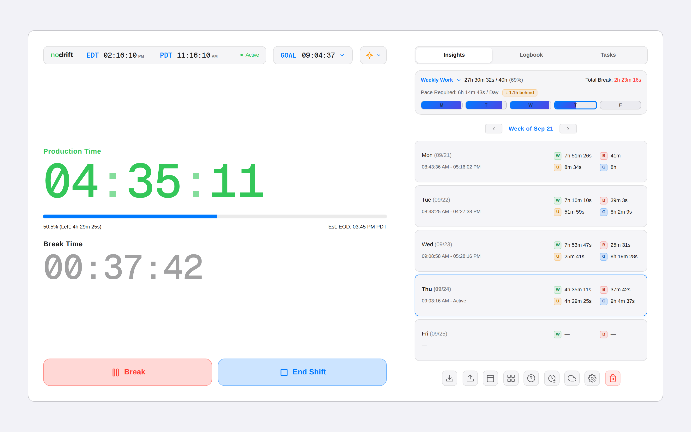
</picture>

<p align="center"><sub>A shift in progress on a Thursday. Work time is New York (EDT), the second clock is where the user is (PDT). All screenshots use generated demo data.</sub></p>

---

## Contents

- [What nodrift is](#what-nodrift-is)
- [What it does](#what-it-does)
- [Keyboard shortcuts](#keyboard-shortcuts)
- [How it works](#how-it-works)
  - [Architecture](#architecture)
  - [Time is an anchor, not a counter](#time-is-an-anchor-not-a-counter)
  - [The life of a shift](#the-life-of-a-shift)
  - [The write path](#the-write-path)
  - [One writer per browser](#one-writer-per-browser)
  - [Cloud sync: three kinds of data, three rules](#cloud-sync-three-kinds-of-data-three-rules)
  - [Live handoff: a lease in Postgres](#live-handoff-a-lease-in-postgres)
  - [Two devices, two clocks](#two-devices-two-clocks)
  - [Time zones without moving history](#time-zones-without-moving-history)
- [Security model](#security-model)
- [Run it yourself](#run-it-yourself)
- [Repository layout](#repository-layout)
- [License](#license)

---

## What nodrift is

nodrift answers one question all day: **am I on pace?**

You press **Work** when you start, **Break** when you step away, and **End Shift** when you are done. The finished day goes into a permanent logbook, gets measured against a daily goal that nodrift recalculates from your weekly target, and rolls up into weekly, monthly and yearly views. It is built for people whose hours are counted: contractors, remote staff reporting to a team in another time zone, anyone with a 40-hour week to hit and a timesheet to send.

Three properties define it.

**Local-first.** Every feature except sync itself works with no account and no network, permanently. Your logbook lives in your browser's IndexedDB, with a synchronous copy in localStorage. None of your data leaves the device unless you sign in to sync.

**One file.** `index.html` is the entire application: markup, about 10,000 lines of CSS and about 31,000 lines of hand-written JavaScript. There is no framework, no bundler, no `package.json` and no `npm install`. The only other files it serves are a service worker, a web manifest and an icon.

**Correct when things go wrong.** Timers are computed from saved wall-clock anchors instead of counted ticks, so background throttling, a sleeping laptop, a crashed tab, a changed system clock, midnight, a time zone change and a second device all resolve to the same, right number. Most of this README's second half is about how.

| At a glance      |                                                                                                                   |
| :--------------- | :---------------------------------------------------------------------------------------------------------------- |
| **Runs on**      | Any current desktop or mobile browser. Installable to the home screen or dock as a PWA, and works offline         |
| **Account**      | Not needed. Optional email and password to sync your devices                                                      |
| **Your data**    | In your browser. With sync on, also in your own rows of a Postgres database, readable only by you                 |
| **Code**         | `index.html`, `sw.js`, `manifest.json`, `icon.svg`                                                                |
| **Dependencies** | None at runtime. Two Google Fonts, with system fallbacks                                                          |
| **Backend**      | Optional. Supabase: three tables, five SQL functions, one edge function, all in [`supabase/`](supabase/README.md) |
| **License**      | [GPL-3.0](LICENSE)                                                                                                |

---

## What it does

### Track the day

The left half of the screen is the tracker: **Production Time** on top, **Break Time** below, and a progress bar between them. Only one timer runs at a time. The bar shows how much of today's goal is done and what is left, and on the right it estimates when you will finish, in your local time. The browser tab's icon changes colour with the timer's state, and an optional setting puts the running time in the tab title.

If a timer is wrong because you forgot to press Break or started late, **Adjust Timer** takes amounts like `+15m`, `-5m 30s` or `1.5h`, previews the result, and offers an Undo afterwards.

### A goal that does the arithmetic

The daily goal fills itself in to keep you on pace for your weekly target (40 hours, Monday to Friday, until you change either). On that default a work day is 8 hours, and any difference lands on the next work day: log 10 on Monday and Tuesday asks for 6; log 7 and Tuesday asks for 9. If you'd rather not pay a shortfall back all at once, the work week settings can spread it across the days you have left. Booked leave takes a work day off the weekly total, so the other days are not asked to cover it. You can override the goal at any time from its presets, and once a day's first shift is saved its goal is locked, so changing tomorrow's target never rewrites yesterday.

### A work week that is yours

Pick any mix of the seven days as work days, and start the week on Monday, Sunday or Saturday. The weekly goal is shared equally between your work days. A day off has its own goal (three quarters of a work day unless you set one, and `0` means it asks nothing), and you choose whether day-off hours count toward the week. A shortfall can land on the next work day or be spread across the rest of the week. Every change applies from the current week onward. Weeks that have ended keep the schedule, target and result they had, because the schedule carries its own history.

### Two clocks, any time zone

nodrift keeps a **work time zone**, the one your team reports in, and a **local time zone**, where you actually are. The work zone decides what "today" is, when midnight falls and which date a shift is filed under. The local zone drives the second clock and the finish estimate, and it can follow the device as you travel. Every record remembers the zone it was filed in, so changing zones never moves a past shift. If a shift was filed in the wrong zone, the edit dialog can move it, either keeping the real moment it happened or keeping the times as written. A preview shows both readings before you save.

Times display as 12-hour or 24-hour, and dates as `MM/DD/YY`, `DD/MM/YY` or `YYYY-MM-DD`. Typed input understands both clocks and your chosen date order.

### Protection that runs by itself

- **Idle lock.** With no typing, clicking or scrolling past your threshold (1 hour by default), the timer pauses at your last input. When you return, nodrift shows exactly how long the gap was and asks whether it was work, break, or nothing.
- **Sleep detection.** A laptop lid closing or a browser freezing the tab is caught on wake and gets the same question.
- **Midnight rollover.** A shift still running at midnight in your work zone is filed under the day that ended, and the new day starts fresh.
- **Accidental shifts.** Ending a shift under 60 seconds asks you to confirm first.
- **One tab at a time.** A second tab cannot silently overwrite the first. It offers to take over instead.
- **Storage failures are loud.** If the browser refuses to save (private mode, blocked storage, a full disk), a red **RAM Only** badge appears and tells you to export.

Idle lock can be switched off, which is the better setting on a phone that sits in a pocket. Everything else always runs.

<p align="center">
  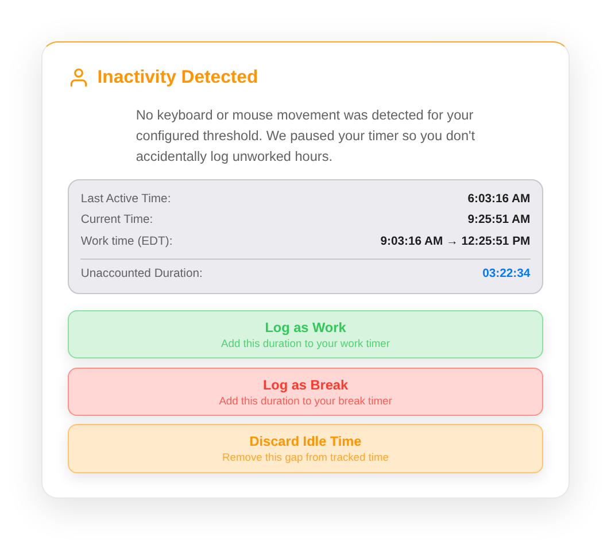
</p>

### Logbook, tasks and leave

<p align="center">
  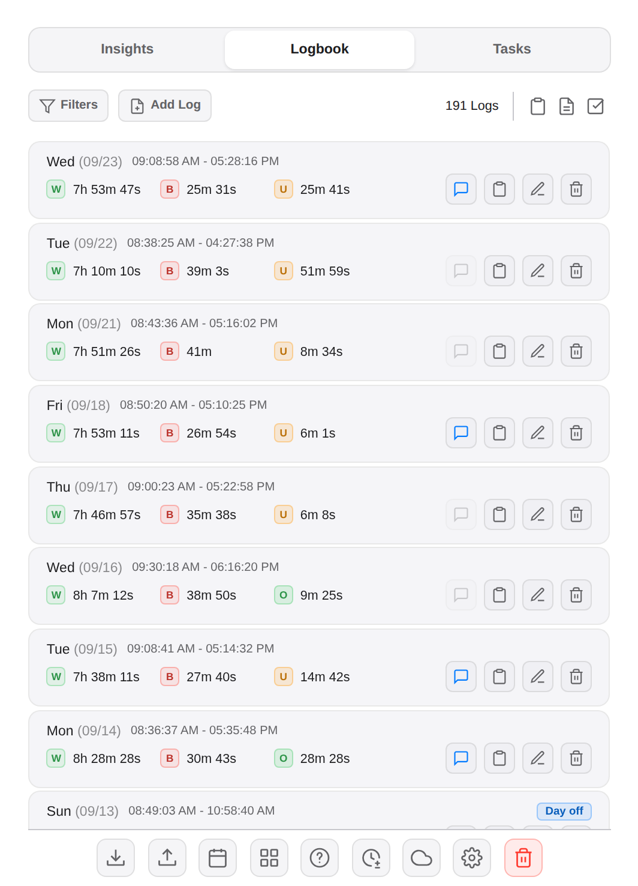
</p>

The **Logbook** holds every saved shift, newest first, and stays smooth with thousands of rows because it only renders the rows on screen. Add a shift you did not track live by filling in any two of login, logout and work time, and the third is worked out. Date fields take shorthand such as `t`, `y`, `-3`, `jan 15` or `122526`, and time fields take `900`, `9:30p` or `1730`. Filter by date, hours or text, and save a filter you use often as a named view. **Copy** puts a plain-text summary on the clipboard (short days flagged), and **CSV** downloads what you are looking at, ready for a spreadsheet.

**Tasks** is a separate stopwatch for timing pieces of work inside the day, with its own history, filters and export. It never touches the shift timers.

**Leave** books days off by type (Casual, Sick (IPD), Sick (OPD), Annual, In Lieu, or types you add) and tracks each type's allowance, used and remaining days. A leave day is striped in the insights and left out of the pace maths.

### Insights and the heatmap

**Insights** shows the week as one bar per work day, with total work, total break, the **pace required** per remaining day to still hit the target, and a plain-language ahead-or-behind verdict. Switch to monthly (one row per week) or yearly (one row per month), and step back through time with `[` and `]`. Hover a day for its full breakdown and notes.

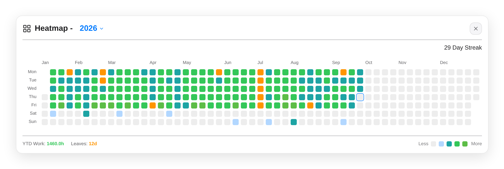

The **heatmap** shows the whole year one square per day, with your current streak, year-to-date hours and leave used. Clicking a square jumps to that day in the logbook with the filters already set.

### Backups, snapshots and restore

- **JSON backup** is one file holding every shift, task, leave day, saved view and preference. `Ctrl`/`Cmd` + `S` downloads it and opens an email draft to send it to yourself, and a setting can save one automatically at the end of every shift.
- **Restore** merges a backup into what you have instead of replacing it. When the backup and this device disagree about the same days, a side-by-side conflict view lets you keep yours, take the backup's, or keep both.
- **Snapshots** are automatic. The first change each day captures the logbook as it was before that change, and the five most recent are kept, so a bad edit or a regretted delete can be rolled back from Settings.
- **End-of-day email.** Optionally, ending a shift copies a formatted summary and opens an email draft.

### Cloud sync, if you want it

Sign in from the cloud button and this device keeps its shifts, tasks, leave, saved views and preferences in step with your other devices. It is off by default, and signed out, nothing leaves the machine.

- **Live handoff.** Start a shift on the laptop, open the phone, and the phone shows the same running timer, to the second, with a **Continue here** button. Only one device may drive the session at a time. Ending the shift on one device clears it on the others.
- **Offline is normal.** Edits made offline wait in a queue that survives a crash and go up when the network returns. A device that has been away for a week cannot overwrite newer data, because the server refuses stale writes.
- **You can see what it is doing.** The sync panel shows each device, which one holds the session, the last push and pull, anything still waiting, and the measured clock offset. **Copy diagnostics** puts all of it on the clipboard.
- **Leaving is clean.** _Sign out_ keeps this device's data. _Sign out & erase this device_ clears it here only. _Sign out everywhere_ signs out every device. Deleting the account removes it and every row it owns.

### Four themes, and a real phone layout

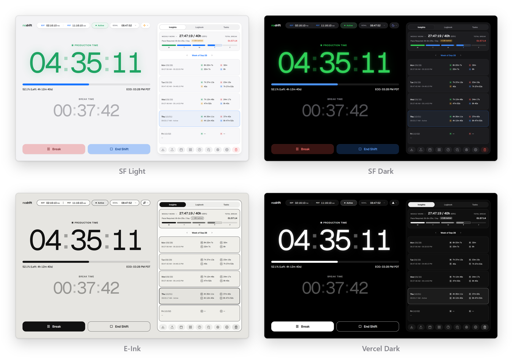

**SF Light**, **SF Dark**, **E-Ink** and **Vercel Dark**. The first launch follows your system's light or dark setting, and `Alt` + `T` cycles themes. Animations follow your system's reduced-motion setting.

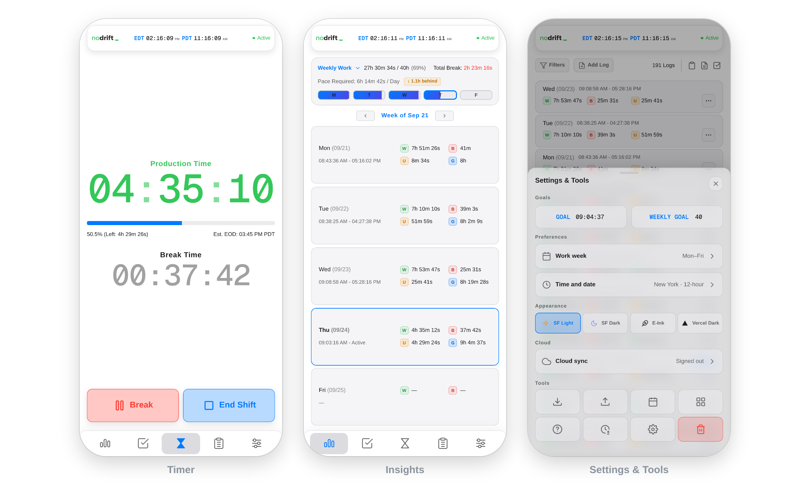

Under 768 px wide, nodrift becomes a phone app with five tabs along the bottom (Insights, Tasks, Timer, Logbook, Settings & Tools) and bottom sheets for everything else. Add it to your home screen and it runs full screen and offline.

---

## Keyboard shortcuts

Shortcuts are ignored while you type in a field and while the idle prompt is waiting. `?` opens the full in-app guide.

| Keys                                                        | Action                                               |
| :---------------------------------------------------------- | :--------------------------------------------------- |
| <kbd>Space</kbd>                                            | Start the shift, take a break, or go back to work    |
| <kbd>S</kbd>                                                | End the shift and open the save dialog               |
| <kbd>Ctrl</kbd>/<kbd>Cmd</kbd> + <kbd>S</kbd>               | Download a JSON backup and open an email draft       |
| <kbd>Alt</kbd> + <kbd>=</kbd> / <kbd>-</kbd>                | Raise or lower today's goal by 15 minutes            |
| <kbd>Alt</kbd> + <kbd>1</kbd> / <kbd>2</kbd> / <kbd>3</kbd> | Insights, Logbook, Tasks                             |
| <kbd>Alt</kbd> + <kbd>K</kbd>                               | Search the logbook                                   |
| <kbd>Alt</kbd> + <kbd>N</kbd>                               | Add a shift by hand                                  |
| <kbd>Alt</kbd> + <kbd>T</kbd>                               | Next theme                                           |
| <kbd>[</kbd> / <kbd>]</kbd>, <kbd>H</kbd>                   | Previous or next week in Insights, back to this week |
| <kbd>↑</kbd> / <kbd>↓</kbd>                                 | Move through logbook or task rows                    |
| <kbd>E</kbd> · <kbd>C</kbd> · <kbd>N</kbd> · <kbd>D</kbd>   | On a highlighted row: edit, copy, read note, delete  |
| <kbd>Enter</kbd> · <kbd>Esc</kbd>                           | Confirm the open dialog · close the dialog on top    |
| <kbd>?</kbd>                                                | Open the guide                                       |

---

## How it works

### Architecture

Everything above runs inside one page. Two small Web Workers are created from inline source at startup, storage is split between a synchronous and an asynchronous store, and the sync backend is a set of plain `fetch` calls (no SDK) to Supabase, used only after you sign in. Around the page, a service worker keeps the app shell cached for offline launches, and a browser-level lock keeps a second tab from writing at the same time.

<p align="center">
  <picture>
    <source media="(prefers-color-scheme: dark)" srcset="docs/assets/diagrams/architecture-dark.png" />
    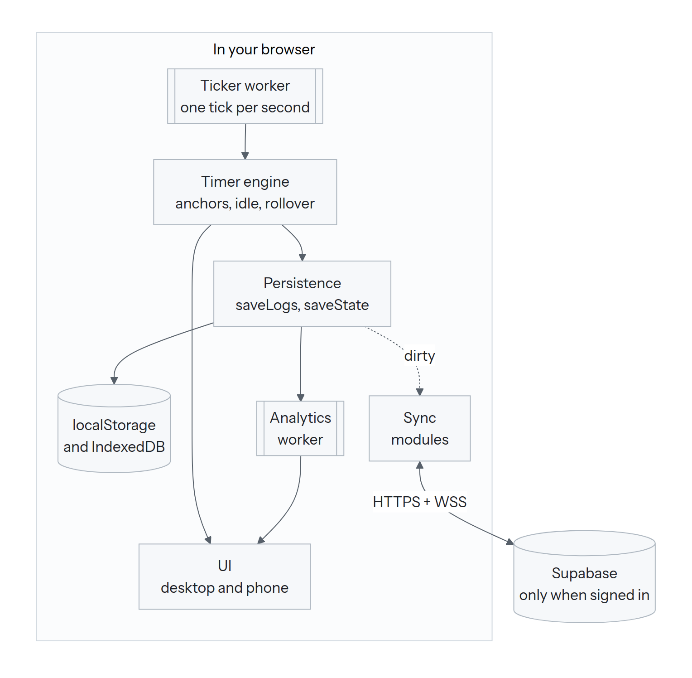
  </picture>
</p>

The rest of this section walks through the decisions that make the numbers trustworthy.

### Time is an anchor, not a counter

The obvious timer adds one to a counter every second. That breaks the moment the browser throttles a background tab, the laptop sleeps, or the tab crashes: every missed tick is lost time. nodrift never counts. It saves the instant the current segment began, `sessionAnchorWall`, and derives elapsed time whenever it needs it:

```
elapsed = max(now − sessionAnchorWall, activeSegmentFloorSec)
```

The tick only decides when to redraw. A tab that was frozen for an hour shows the right number on its first frame back, and a page reloaded mid-shift carries on from the saved anchor.

The `max` handles one narrow failure. If the process is killed and the system clock is set backwards before the next launch, `now − anchor` would shrink. So every save records the highest elapsed value seen so far (`activeSegmentFloorSec`), and time inside a segment can never go backwards. Setting a new anchor always resets its floor, so a floor can never outlive the anchor it was measured against.

<p align="center">
  <picture>
    <source media="(prefers-color-scheme: dark)" srcset="docs/assets/diagrams/ticker-dark.png" />
    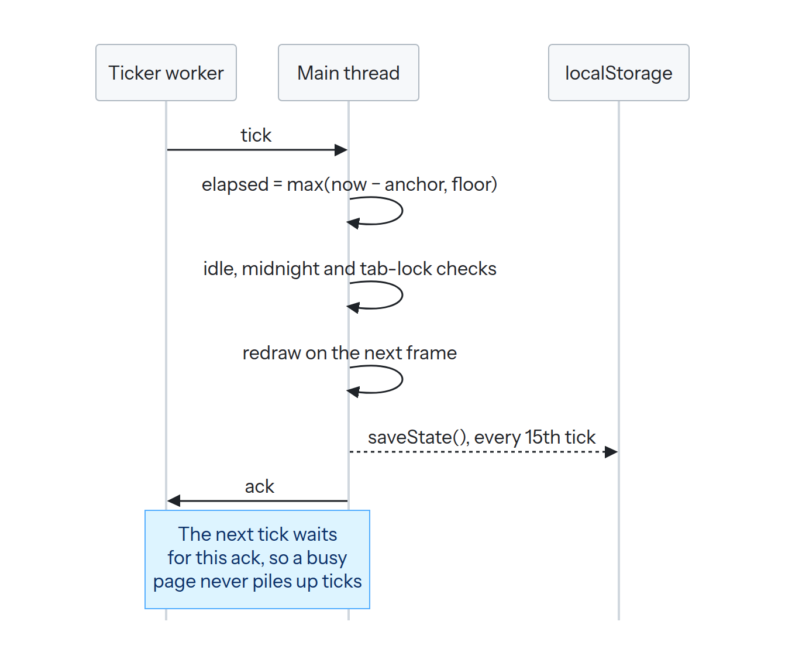
  </picture>
</p>

The ticker lives in a worker, which background tabs throttle far less than page timers, so the tab-title clock keeps ticking while you are in another tab. With that setting off, a hidden page stops ticking altogether: there is nothing to draw, and on return the wake-up path recomputes everything from the anchors and checks for sleep, idleness and midnight. Where a worker cannot be created, the same interface falls back to a main-thread timer.

**The clock policy.** nodrift trusts the system clock, the same way server-backed trackers do. Cross-checking it against `performance.now()` sounds safer but does not work in a browser, because the monotonic clock stops while a tab is frozen or a phone is locked, and every wake would look like a clock change. What it does defend, because those cases are provable:

1. **Backward steps across a reload.** A saved timestamp that sits in the future can only mean the clock moved back while the app was closed, and every in-flight anchor is shifted by the difference.
2. **Monotonic segments.** The floor above.
3. **Commit-time checks.** A shift whose window is too short to contain its own hours is refused, not saved.

Every correction is written to an anomaly log that survives reloads, so timekeeping can be audited afterwards.

### The life of a shift

<p align="center">
  <picture>
    <source media="(prefers-color-scheme: dark)" srcset="docs/assets/diagrams/lifecycle-dark.png" />
    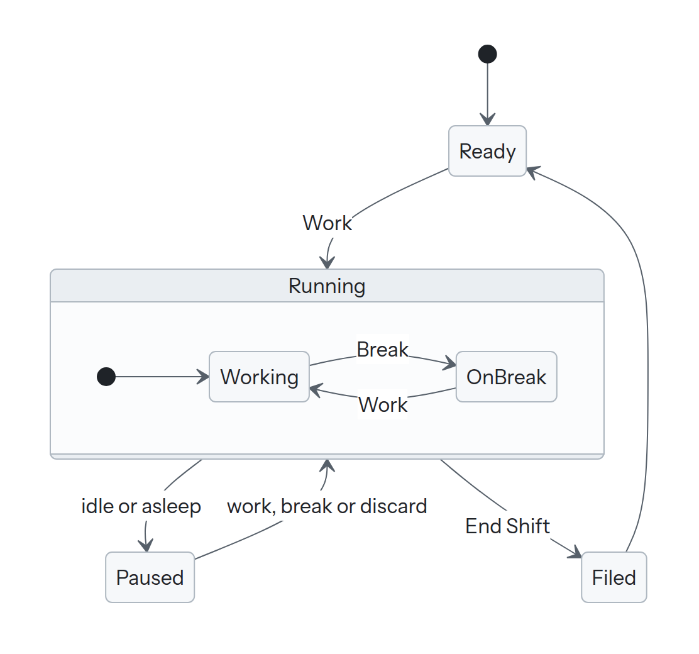
  </picture>
</p>

**Paused** rewinds to your last input, so the gap is measured precisely and then assigned to work, to break, or to nothing, in which case the shift resumes in whichever mode it was in. When the app itself was closed rather than idle, it credits the gap without asking if it was short enough to be a reload or a crash (up to 90 seconds), and asks otherwise.

**Midnight** in the work zone, while a shift is running, files the part before midnight under the day that ended and carries on under the new date.

**Filed** writes one log record: the business date, the zone that decided it, the two instants, work and break seconds, the goal it was measured against, your note, and a `lastModified` stamp that sync uses to settle conflicts.

### The write path

Every change to the logbook, whether from the timer, an edit, an import or a sync merge, goes through one function, `saveLogs()`. It writes in a deliberate order:

<p align="center">
  <picture>
    <source media="(prefers-color-scheme: dark)" srcset="docs/assets/diagrams/write-path-dark.png" />
    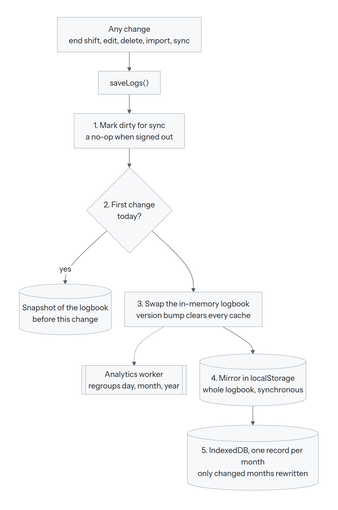
  </picture>
</p>

- **The snapshot is taken before the change lands.** A restore point that already contains the accident cannot undo it.
- **The mirror is synchronous.** localStorage writes finish before the function returns, so even a tab killed mid-save leaves one complete copy. If IndexedDB cannot be opened at the next launch, nodrift boots from the mirror and freezes writes, so a partial view can never be saved over the full database. When the page is opened straight from disk, nodrift does not use IndexedDB at all and the mirror is the store.
- **The main store is chunked by month.** Editing one shift rewrites one month, not the whole history.
- **Durable storage is requested at startup**, so the browser does not evict the data under storage pressure or Safari's seven-day purge of script-written storage.
- **A full disk never truncates.** If the mirror cannot be written, the previous complete copy is left in place and the app says so.

### One writer per browser

Two tabs running the same timer would each save their own view and overwrite the other. So one tab holds a lock and every other tab stands aside with a **Take Over Here** button. The lock is the [Web Locks API](https://developer.mozilla.org/docs/Web/API/Web_Locks_API) where the browser has it, which the browser releases when the tab dies. Where it doesn't, the lock falls back to a lease in localStorage, claimed through a staging key with a randomised backoff so two tabs opening together cannot both win. A `BroadcastChannel` tells the others when anything changes. Only the tab holding the lock talks to the network, so three open tabs make one sync client.

### Cloud sync: three kinds of data, three rules

The most important decision in the sync design is **not** treating the app's data as one blob. There are three shapes of data, and each is correct under a different rule:

| Data                                                  | Rule                                                      | Why                                                                                                           |
| :---------------------------------------------------- | :-------------------------------------------------------- | :------------------------------------------------------------------------------------------------------------ |
| **Records**: shifts, tasks, leave days, saved views   | Last writer wins, per record, with tombstones for deletes | Records are independent. Two devices editing different shifts must both keep their edits.                     |
| **The live session**: running timers, mode, idle lock | An exclusive lease. One device writes; the others watch   | There is exactly one real shift. Merging two running timers gives a number that is true of neither.           |
| **Preferences**: goal, work week, zones, formats      | Last writer wins, per preference                          | Settings are not measurements. But an old copy of one setting must not ride in on an edit to a different one. |

**Records.** Rather than recording every delete as it happens (and missing one path some day), each device keeps a _shadow_: a map from record id to the `lastModified` the server last confirmed. The outbox is computed by comparing the logbook with the shadow. Anything new or changed is pushed, and anything the shadow has that the logbook doesn't was deleted, by any code path, including ones not written yet. The shadow only moves forward on a confirmed response, so it doubles as a crash-proof retry queue.

<p align="center">
  <picture>
    <source media="(prefers-color-scheme: dark)" srcset="docs/assets/diagrams/record-sync-dark.png" />
    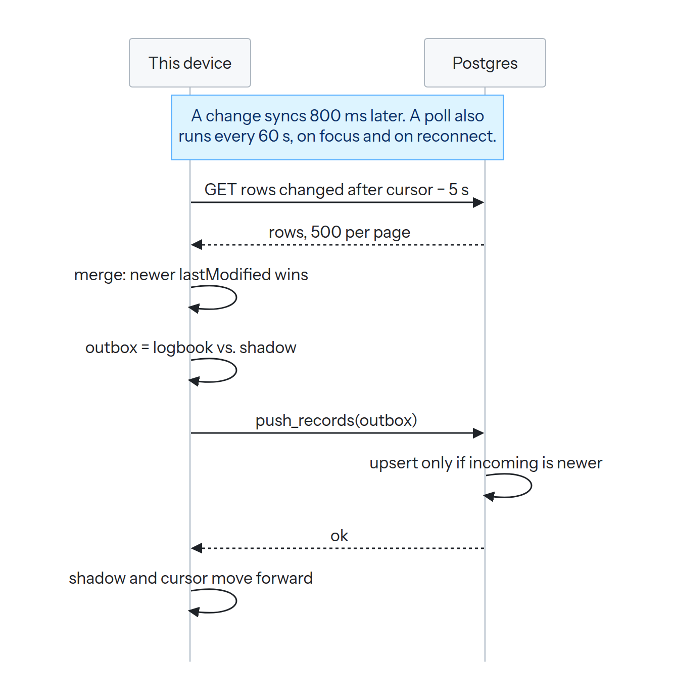
  </picture>
</p>

Three details make this safe:

- **Two timestamps, two jobs.** `last_modified` is when you edited a record, and it decides conflicts. `updated_at` is when the server received it, and it drives the pull cursor. Using one for both loses data: an edit made offline at 09:00 and synced at 14:00 would be invisible to a device whose cursor is already at 11:00.
- **The merge rule is enforced in SQL.** `push_records` only overwrites a row when the incoming copy is newer, so a device that has been offline for a week cannot clobber newer data, even if its client code is wrong.
- **The cursor rewinds five seconds on each pull.** The server stamps rows with `clock_timestamp()` before the commit is visible, so a row can appear slightly behind one already seen. Re-reading a few seconds costs one comparison per record, because the merge is idempotent. A device whose cursor is older than 60 days rebuilds from a full download instead of a delta.

**Preferences** travel as one blob with a stamp for each preference inside it, so a device that changes its clock format cannot resend an older leave balance along with it. Values the app works out for itself, like an automatic goal, are never uploaded as if someone chose them.

### Live handoff: a lease in Postgres

The live session is guarded by the same idea as the tab lock, moved into the database where the compare-and-swap can be atomic. One Postgres function, `sync_session`, claims or renews the lease, writes the session if the caller holds it, reads everything back and returns the server's clock, all in one round trip. The claim and the session write are a single `INSERT … ON CONFLICT DO UPDATE … WHERE` statement, so two devices claiming in the same instant cannot both win.

Every signed-in device is in one of three states:

<p align="center">
  <picture>
    <source media="(prefers-color-scheme: dark)" srcset="docs/assets/diagrams/lease-dark.png" />
    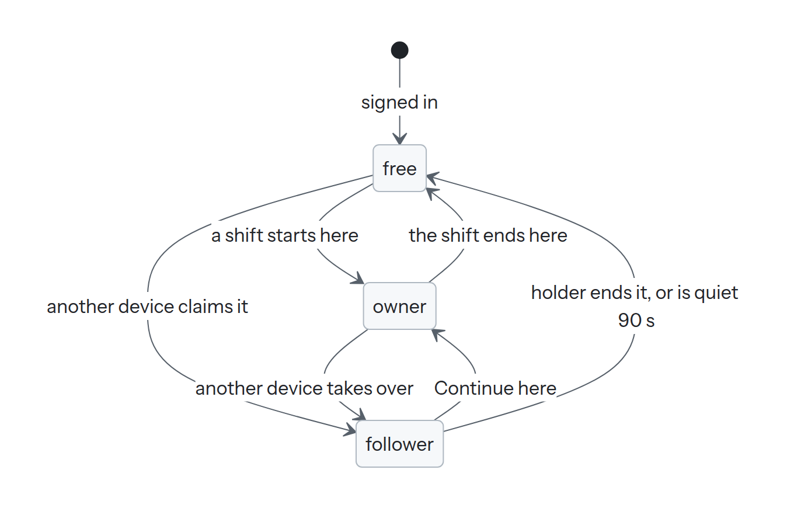
  </picture>
</p>

And this is a handoff from a laptop to a phone, as the database sees it:

<p align="center">
  <picture>
    <source media="(prefers-color-scheme: dark)" srcset="docs/assets/diagrams/handoff-dark.png" />
    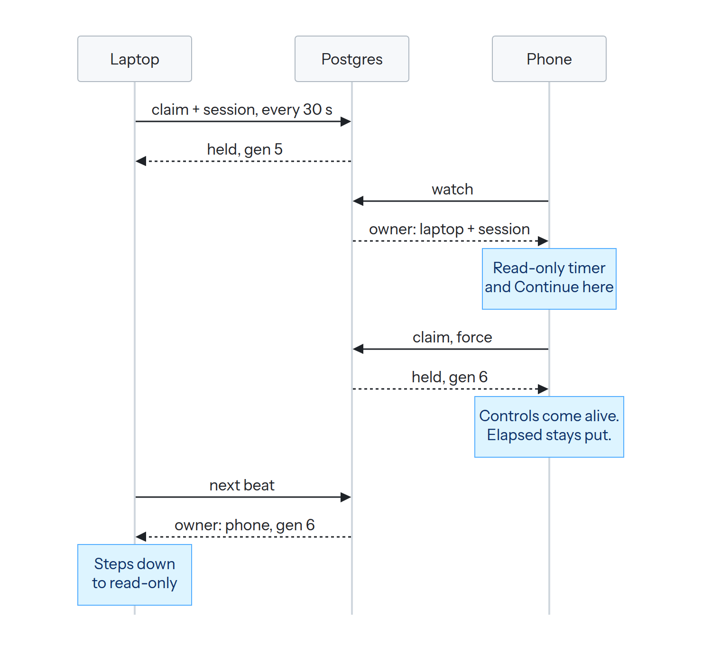
  </picture>
</p>

Handoff is possible at all because of the anchor design. The phone does not replay any history. It receives the anchor and computes the same elapsed. The lease lasts 90 seconds and the holder renews it every 30, so one dropped request never costs the lease, and a laptop that vanishes releases the session within a minute and a half without anyone pressing anything. A device watching someone else's shift checks every 20 seconds, and one with nothing to watch checks every 60.

**Realtime is an accelerator, never a dependency.** When another device has been seen on the account in the last week, nodrift opens a Supabase Realtime socket. It has no data path of its own: an event only makes the app run the same beat or sync its timers would have run anyway, sooner, so handoff feels instant. If the socket is refused or drops, the app is exactly as correct, just slower. Nothing may ever be delivered only over the socket.

### Two devices, two clocks

Two devices' clocks never agree exactly. If a raw timestamp crossed from one device to another, elapsed time would jump by the difference, and last-writer-wins would quietly become fastest-clock-wins.

So local storage always stays in the device's own clock, and conversion happens in exactly two functions at the network boundary: `toWire(t) = t − offset` and `fromWire(t) = t + offset`. Durations cross unchanged, since they have no clock. Signed out, the offset is zero and both functions do nothing.

The offset comes from the server's clock, which every lease heartbeat already returns. Each reading is treated as a **bracket, not a point**: the true offset lies within half a round trip of the estimate, so a fast round trip is a narrow bracket. nodrift keeps the last eight readings and uses the one with the narrowest bracket, because round-trip time _is_ the accuracy. If a new bracket doesn't overlap the best one, one of the two clocks has provably moved, the old readings are discarded, and the new one takes over immediately. A change smaller than its own error bar is ignored as jitter.

Until the offset has been measured, a device refuses to adopt another device's session at all, and it also refuses one whose elapsed time works out negative or longer than a day. A single bad offset applied to an anchor would otherwise show a timer reading of days, and the floor described earlier would preserve it. An adopted session also resets the idle clock, so a phone never inherits the laptop's idleness the moment it takes over.

### Time zones without moving history

Three kinds of time are kept strictly apart:

- **Instants**: absolute moments in epoch milliseconds, with no zone. These are the truth.
- **Business dates**: the `MM/DD/YY` day a record is filed under, decided once, in the work zone, when it is filed. Re-filing a record in another zone is the one edit that can move it.
- **Record zones**: the zone that made that decision, stored on the record.

A running shift carries the zone it started in, so changing the work zone mid-shift (on this device or another) never moves its midnight. The change waits until the shift ends. Records from before time zones existed are read in their original zone forever instead of being rewritten, because rewriting them would restamp and re-upload the whole logbook. Midnight is computed from the zone's own rules, which is exact for half-hour and 45-minute offsets, for daylight-saving days, and for zones west of UTC−8, all of which the previous approach got wrong.

---

## Security model

**A backup file is untrusted input.** It arrives by email or a shared drive, and the same records also arrive from cloud sync, which applies server data without validating fields. So escaping happens where a string becomes markup, not at the import gate: one rule at the sink covers both doors. Record text reaches the page through `textContent`, or through `escapeHTML()` where a template is genuinely clearer. The import validator also rejects prototype-pollution keys.

**An exported CSV is a document somebody else opens.** Every cell goes through `csvCell()`, which doubles quotes and neutralises anything a spreadsheet would evaluate as a formula. Plain numbers are left alone so the columns still sum.

**The CSP is shaped around a single file.** `script-src` has to allow `'unsafe-inline'`, because the whole app is one inline script, so the policy is not a defence against an injection bug (the two rules above are). What it does close is `connect-src`, which names exactly one Supabase host (over `https:` and `wss:`), and `base-uri`, `form-action` and `object-src`, which do not inherit from `default-src`. An injected `<base>` would silently repoint every relative URL, and an injected `<form>` could post the page's contents elsewhere with no script at all. Clickjacking is handled by `X-Frame-Options` in [`vercel.json`](vercel.json), since browsers ignore `frame-ancestors` in a `<meta>` tag. That file also sets `nosniff`, `Referrer-Policy`, HSTS and a restrictive `Permissions-Policy`.

**The key in the page is public by design.** `SUPABASE_ANON_KEY` is a publishable key: it names the project and authorises nothing. Row-level security does the protecting. It is enabled **and forced** on every table (forced means it binds the table owner too), and every policy is scoped to `authenticated` with `user_id = auth.uid()`. A caller holding only the key can read no rows at all. See [`0002_rls.sql`](supabase/migrations/0002_rls.sql).

**The one secret lives in one place.** The service-role key exists only in the `delete-account` edge function's environment, injected by Supabase. That function takes the user id from the verified token, never from the request body, and checks the token itself even though the gateway already did, because the publishable key is also a valid token for this project. The full reasoning, with measurements, is in [`supabase/README.md`](supabase/README.md).

**The repository never holds your data.** [`.gitignore`](.gitignore) blocks the backup file names the app produces, so an accidental `git add -A` cannot publish a logbook.

---

## Run it yourself

### Use the hosted app

Open **[nodrift.vercel.app](https://nodrift.vercel.app)** and press <kbd>Space</kbd>. There is nothing to sign up for. To install it, use your browser's **Install app** option, or **Add to Home Screen** on a phone.

### Run it locally

```sh
git clone https://github.com/salehinafnan/nodrift.git
cd nodrift
python3 -m http.server 8080
```

Then open <http://localhost:8080>. Any static file server works.

You can also double-click `index.html` and it will run from `file://`, with limits: nodrift does not use IndexedDB there, so the logbook lives only in localStorage (about 5 MB), service workers are unavailable, so it cannot install or work offline, and background workers may be blocked. Use a server for anything you care about.

### Deploy your own copy

The repository root is the web root. Deploy the folder as it is to Vercel, Netlify, GitHub Pages, or any static host. There is no build, no environment variables and no server. Two things to keep:

- `sw.js` and `manifest.json` must stay beside `index.html`, because a service worker can only control pages at or below its own directory.
- On Vercel, keep `vercel.json` to headers only. Adding `builds` or `routes` takes the project out of zero-config static hosting.

Browser storage belongs to one origin, so moving to a new domain means exporting a JSON backup and restoring it there, or signing in to sync.

### Bring your own sync backend

Out of the box the app points at the author's Supabase project. To use your own:

1. Create a Supabase project and enable email sign-in. For public sign-ups, configure custom SMTP, since the built-in sender allows only a few emails an hour and confirmation and password reset both use emailed codes.
2. Run [`supabase/migrations/`](supabase/migrations) in filename order in the SQL editor. `0006` and `0007` (realtime) are optional. Every file is idempotent.
3. Deploy the account-deletion function: `npx supabase functions deploy delete-account --project-ref <ref>`.
4. In `index.html`, change `SUPABASE_URL` and `SUPABASE_ANON_KEY`, **and** the Supabase host in the CSP's `connect-src`, which lists it twice (`https://` and `wss://`). If you miss the CSP, the browser blocks every request and the app reports a server it cannot reach.

[`supabase/README.md`](supabase/README.md) explains every table, policy and function, and why each one is shaped the way it is.

---

## Repository layout

```
nodrift/
├── index.html              The entire app: markup, styles and scripts
├── sw.js                   Service worker: network-first for the page, cached for offline
├── manifest.json           PWA manifest
├── icon.svg                App icon
├── vercel.json             Security headers for the hosted copy
├── supabase/
│   ├── README.md           The sync backend, explained
│   ├── migrations/         0001–0008: schema, RLS, functions, lease, realtime
│   └── functions/
│       └── delete-account/ The only code that runs outside the browser
└── docs/
    └── assets/
        ├── screenshots/    The images in this README
        └── diagrams/       Diagram sources (.mmd) and their renders
```

Inside `index.html`, the script is organised into twenty numbered sections, from state and DOM bindings through the clock policy, the IndexedDB engine, the multi-tab lock, timers, rendering, idle auditing, the virtualised logbook and backups, to initialisation. Self-contained modules sit between them, each an IIFE with a small API on `window`: `WorkWeek`, `TimeZones`, `ZoneCatalog`, `ZonePicker`, `Sync`, `SyncNet`, `SyncEngine`, `SessionLease`, `SyncLive` and `MobileShell`. Formatting follows [Prettier](https://prettier.io) with CRLF line endings, which [`.gitattributes`](.gitattributes) enforces for every clone.

There is no automated test suite in this repository. Behaviour was verified with a separate harness that drives the real app in headless Chrome, including multi-device and clock-skew scenarios against a live test database. That harness is deliberately kept out of the repository because it holds a test account's fixtures.

---

## License

nodrift is free software under the [GNU General Public License v3.0](LICENSE).
